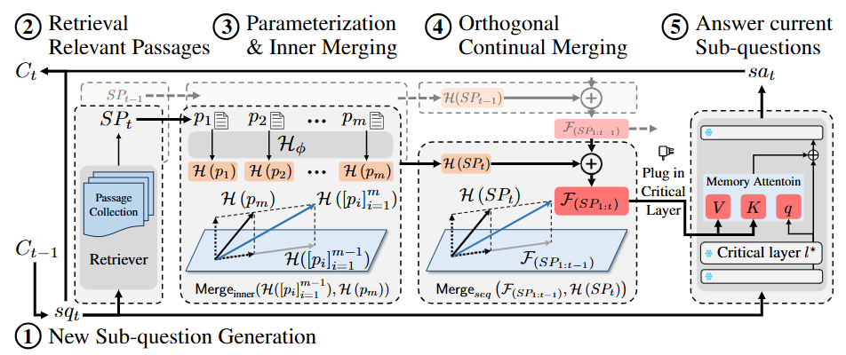
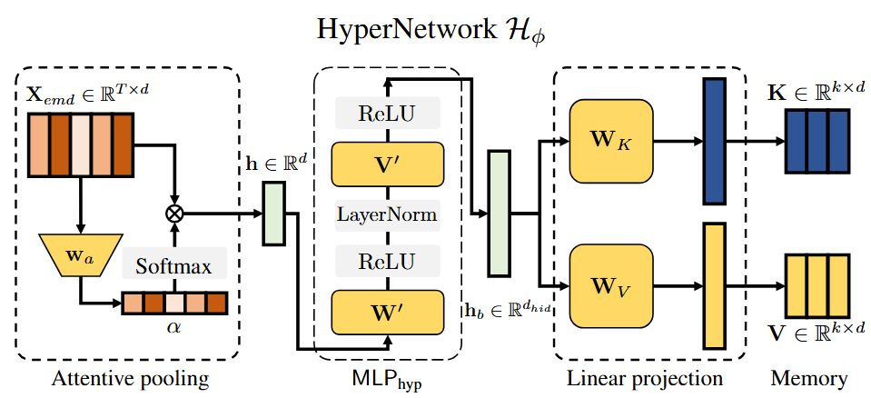

# MergePRAG: Orthogonal Merging of Passage-experts for Multi-hop Parametric RAG

This repository contains the implementation of our paper:

**MergePRAG: Orthogonal Merging of Passage-experts for Multi-hop Parametric RAG**

Our paper has been accepted at **ICLR 2026**.



---

## Introduction

Multi-hop question answering requires a model to retrieve, integrate, and reason over evidence across multiple steps. To address this challenge, we propose **MergePRAG**, a framework for **multi-hop parametric retrieval-augmented generation (Parametric RAG)**.

MergePRAG is based on the idea of **orthogonal merging of passage experts**, which enables the model to incrementally absorb passage-level knowledge into its parameters while reducing interference between different passages. This repository provides the full implementation of the MergePRAG pipeline, including:

- training a **sub-question decomposer**,
- finding the **best insertion layer** through causal tracing,
- training the **hypernetwork**,
- and running inference with either **E5** or **BM25** retrieval.



---

## Project Structure

### Main Files and Directories

- `Causal Tracing/`  
  Contains layer scanning experiments for identifying the best insertion layer.

- `Decomposer/`  
  Contains scripts for preparing decomposition data and training the sub-question decomposer.

- `config/config.yaml`  
  Main configuration file for dataset paths, training settings, layer selection, and other hyperparameters.

- `KV_train.py`  
  Training script for the MergePRAG hypernetwork.

- `KV_inference.py`  
  Inference script for MergePRAG using **E5** as the retriever.

- `KV_inference_BM25.py`  
  Inference script for MergePRAG using **BM25** as the retriever.

---

## Workflow

> **Important:** Before starting any experiment, please first configure the data paths in `config/config.yaml`.

### Step 1: Prepare data and train the decomposer

First, use `prepare_data_for_decomposition.py` to collect training data for the sub-question decomposer. Then train a decomposer adapted to your target task dataset.

```bash
python Decomposer/prepare_data_for_decomposition.py
python Decomposer/decomposer.py
```

This step builds a task-specific question decomposer that splits a complex multi-hop question into a sequence of sub-questions.

---

### Step 2: Search for the best insertion layer

Run the layer scanning experiment in `Causal Tracing` to identify the best insertion layer for the backbone model.

```bash
python "Causal Tracing/layer_scanning.py"
```

This step helps determine the most effective layer for injecting the hypernetwork-generated key-value updates.

---

### Step 3: Train the MergePRAG hypernetwork

After updating the configuration file with:

- the correct dataset path,
- the best insertion layer found in Step 2,
- and the desired hyperparameters,

train the hypernetwork with:

```bash
python KV_train.py
```

---

### Step 4: Run inference

After training, load the learned hypernetwork weights and run inference using one of the following scripts:

#### Inference with E5 retriever
```bash
python KV_inference.py
```

#### Inference with BM25 retriever
```bash
python KV_inference_BM25.py
```

---

## End-to-End Pipeline

The complete recommended pipeline is as follows:

1. Configure data paths in `config/config.yaml`.
2. Use `Decomposer/prepare_data_for_decomposition.py` to prepare decomposition training data.
3. Train the decomposer with `Decomposer/decomposer.py`.
4. Use `Causal Tracing/layer_scanning.py` to find the best insertion layer.
5. Update `config/config.yaml` with the selected layer and hyperparameters.
6. Train the MergePRAG hypernetwork with `KV_train.py`.
7. Run inference with `KV_inference.py` or `KV_inference_BM25.py`.

---

## Notes

- Please make sure all dataset paths in `config/config.yaml` are correctly set before running any script.
- The decomposer should be trained on data aligned with the target multi-hop QA dataset.
- The insertion layer selected by causal tracing is important for final performance.
- You can choose between dense retrieval (**E5**) and sparse retrieval (**BM25**) depending on your experimental setting.

---

## Citation

If you find this repository useful in your research, please consider citing our paper:

```bibtex
@inproceedings{
liu2026mergeprag,
title={Merge{PRAG}: Orthogonal Merging of Passage-experts for Multi-hop Parametric {RAG}},
author={Xuebing Liu and Shanbao Qiao and Roseline Nyange and Dongwook Min and Hyun Kim and Seung-Hoon Na},
booktitle={The Fourteenth International Conference on Learning Representations},
year={2026},
url={https://openreview.net/forum?id=FSL1J2gmJV}
}
```

---

## Acknowledgement
This repository is the implementation of our ICLR 2026 paper on multi-hop parametric RAG with orthogonal merging of passage experts.
